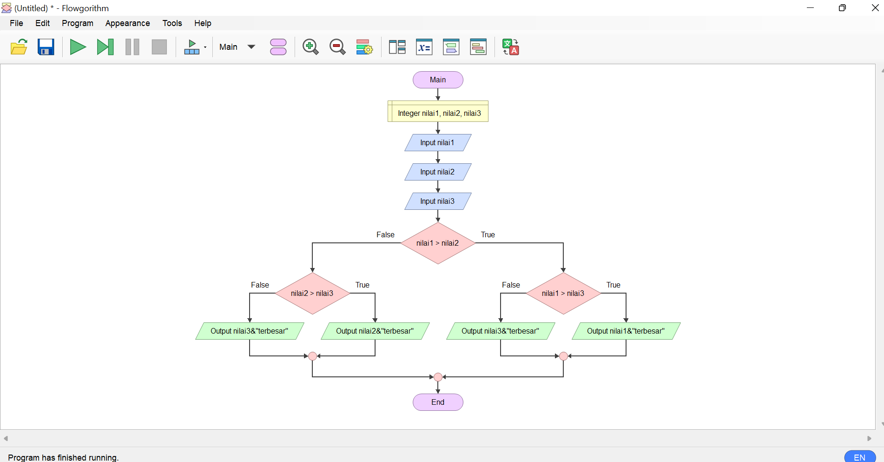
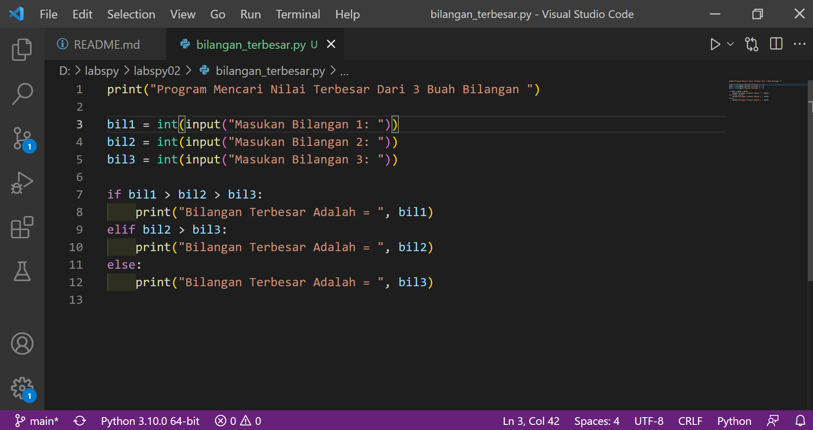
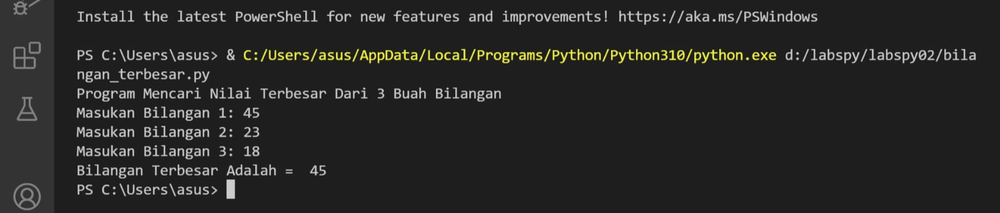
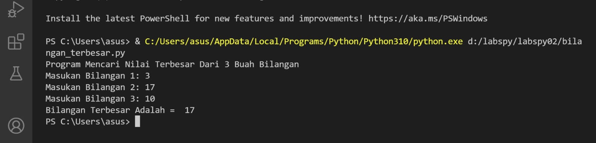
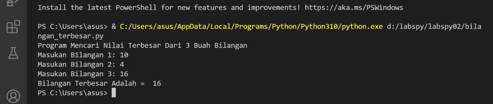

# labspy02
## Algoritma Menentukan Nilai Terbesar dari 3 Buah Bilangan 
### Flowchart

Berikut flowchart untuk menentukan nilai terbesar dari 3 buah bilangan

 

#### Strutur Teks

1.  Mulai

2.  Input nilai1

3.  Input nilai2

4.  Input nilai3

5.  Jika nilai1 > nilai2 maka kerjakanlah langkah 6 , selain itu kerjakanlah langkah 7 

6.  Jika nilai1 > nilai3 maka cetak nilai1 terbesar , selain cetak nilai3 terbesar

7.  Jika nilai2 > nilai3 maka kerjakan nilai2 terbesar , selain itu nilai3 terbesar

8.  Selesai. 

### Menggunakan Statemen If Untuk Mencari Nilai Terbesar Dari 3 Buah Bilangan
#### Berikut Program dan Hasilnya 

- untuk bilangan pertama saya tulis "bil1",untuk bilangan kedua saya tulis "bil2" dan untuk bilangan ketiga saya tulis "bil3"

-Dengan Pernyataan cara , jika (if) sebagai "bil1" untuk bilangan pertama , elif sebagai "bil2" untuk bilangan kedua ,dan lain (else) sebagai "bil3" untuk bilangan ketiga .

-Berikut Program yang saya buat

 Untuk hasil program yang dijalankan dengan bilangan pertama yang terbesar

 Sedangkan untuk hasil program yang dijalankan dengan bilangan kedua yang terbesar

 Dan untuk hasil program yang dijalankan dengan bilangan ketiga yang terbesar

