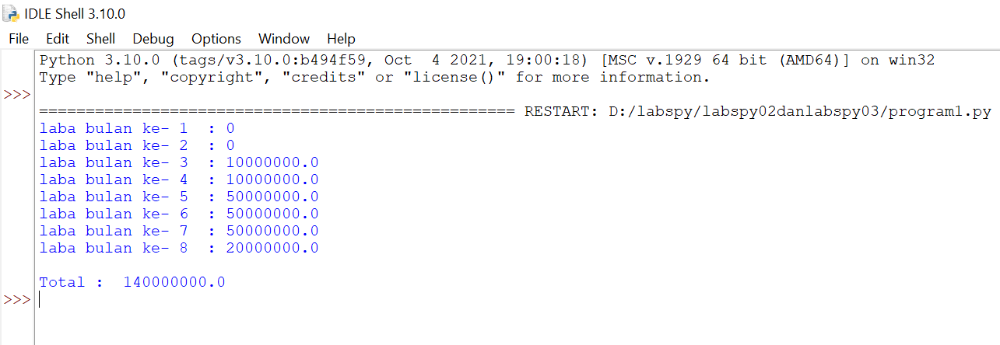

# Labspy02 Dan Labspy03
## Algoritma Menentukan Nilai Terbesar dari 3 Buah Bilangan 
### Flowchart

Berikut flowchart untuk menentukan nilai terbesar dari 3 buah bilangan

 

#### Strutur Teks

1.  Mulai

2.  Input nilai1

3.  Input nilai2

4.  Input nilai3

5.  Jika nilai1 > nilai2 maka kerjakanlah langkah 6 , selain itu kerjakanlah langkah 7 

6.  Jika nilai1 > nilai3 maka cetak nilai1 terbesar , selain cetak nilai3 terbesar

7.  Jika nilai2 > nilai3 maka kerjakan nilai2 terbesar , selain itu nilai3 terbesar

8.  Selesai. 

### Menggunakan Statemen If Untuk Mencari Nilai Terbesar Dari 3 Buah Bilangan
#### Berikut Program dan Hasilnya 

- untuk bilangan pertama saya tulis "bil1",untuk bilangan kedua saya tulis "bil2" dan untuk bilangan ketiga saya tulis "bil3"

-Dengan Pernyataan cara , jika (if) sebagai "bil1" untuk bilangan pertama , elif sebagai "bil2" untuk bilangan kedua ,dan lain (else) sebagai "bil3" untuk bilangan ketiga .

-Berikut Program yang saya buat

 Untuk hasil program yang dijalankan dengan bilangan pertama yang terbesar

 Sedangkan untuk hasil program yang dijalankan dengan bilangan kedua yang terbesar

 Dan untuk hasil program yang dijalankan dengan bilangan ketiga yang terbesar

# Labspy03
## Latihan 1
### Program untuk menampilkan n bilangan acak yang lebih kecil dari 0,5
#### cara pengerjaanya 

•Buka aplikasi python atau lainya menggunakan program python , disini saya menggukanan aplikasi IDLE (python 3,10  64-bit)

•jika sudah lakukan kodingan seperti gambar dibawah ini :

•Jika sudah bisa menyimpan program kalian dengan menekan CTRL + S atau mengklik file menu save as dan beri nama programnya

•Lalu jalankan program kalian dengan menekan f5 atau mengklik menu Run

•Dan jika berhasil maka tampilan pada program python anda akan seperti ini:

Berikut penjelasanya

print ('Masukkan nilai N: 5')

Penjelasan program diatas sebagai berikut.

impor acak

jumlah = 5

a = 0

untuk x dalam rentang (jumlah):

i = random.uniform(.0,.5)

a+=1

print('data ke:',a,'==>', i)

cetak ('selesai')

"print" : berfungsi untuk mencetak atau menampilkan objek ke perangkat keluaran (layar) atau ke file teks.

"import" : fungsi lanjut yang dipanggil oleh statement import.

"random" : untuk menentukan suatu pilihan.

"range" : merupakan fungsi yang menghasilkan daftar. Fungsi ini akan menciptakan sebuah daftar baru dengan rentang nilai tertentu.

"uniform": digunakan untuk menampilkan bilangan float random dengan batas awal bilangan x, dan batas akhir bilangan y.

## Latihan 2
### Buat program untuk menampilkan bilangan terbesar dari n buah data yang diinputkan

Penjelasan alur program 
Membuat program menampilkan bilangan terbesar dari n buah data yang diinputkan  , dengan masukan angka 0 untuk berhenti

#### cara pengerjaanya 

•Buka aplikasi python atau lainya menggunakan program python , disini saya menggukanan aplikasi IDLE (python 3,10  64-bit)

•jika sudah lakukan kodingan seperti gambar dibawah ini :

•Jika sudah bisa menyimpan program kalian dengan menekan CTRL + S atau mengklik file menu save as dan beri nama programnya

•Lalu jalankan program kalian dengan menekan f5 atau mengklik menu Run

•Dan jika berhasil maka tampilan pada program python anda akan seperti ini:

]

Penjelasan program diatas sebagai berikut.
maks = 0

sementara Benar:

a=int(input('Masukkan bilangan='))

jika maks < a:

maks =

jika a==0:

merusak

print('Bilangan terbesarnya adalah',maks)

"max" : fungsi bulid-in untuk mencari nilai tertinggi. Fungsi ini dapat diberikan sebuah parameter berupa angka.

" while" : disebut uncounted loop (perulangan yang tak terhitung), untuk perulangan yang memiliki syarat dan tentu berapa banyak perulangannya.

"int" : berfungsi sebagai bilangan maupun string angka menjadi bilangan bulat (integer).

"if" = Bila suatu kondisi tertentu tercapai maka apa yang harus dilakukan. Dengan fungsi ini kita bisa menjalankan suatu perintah dalam kondisi tertentu.

"input" : masukan yang kita berikan ke program.

"break" : fungsi yang dihentikan operasi di bawahnya jika suatu kondisi yang ditentukan telah tercapai.

"print" : berfungsi untuk mencetak atau menampilkan objek ke perangkat keluaran (layar) atau ke file teks.

## Program1
### program untuk menghitung laba investasi
#### cara pengerjaanya 

•Buka aplikasi python atau lainya menggunakan program python , disini saya menggukanan aplikasi IDLE (python 3,10  64-bit)

•jika sudah lakukan kodingan seperti gambar dibawah ini :

•Jika sudah bisa menyimpan program kalian dengan menekan CTRL + S atau mengklik file menu save as dan beri nama programnya

•Lalu jalankan program kalian dengan menekan f5 atau mengklik menu Run

•Dan jika berhasil maka tampilan pada program python anda akan seperti ini:

Penjelasan program diatas sebagai berikut.
masukkan nilai a

digunakan untuk perulangan dari 1 sampai 8.Perulangan for disebut count loop (perulangan yang terhitung)

lalu gunakan if pertama untuk menentukan laba bulan ke 1 dan ke 2.masukan variabel (b) kalikan nilai (a) dengan data bulan 1 dan 2. cetak (x) dan (b)

lalu gunakan if kedua untuk menentukan laba bulan ke 3 dan ke 4.masukan variabel (b) kalikan nilai (a) dengan data bulan 3 dan 4. cetak (x) dan (c)

lalu gunakan jika ketiga untuk menentukan laba bulan ke 5 sampai ke 7.masukan variabel (b) kalikan nilai (a) dengan data bulan 5 sampai 7. cetak (x) dan (d)

lalu gunakan keempatnya untuk menentukan laba bulan ke 8.masukan variabel (b) kalikan nilai (a) dengan data bulan 8. cetak (x) dan (e)

lalu total keseluruhan.

cetak total
